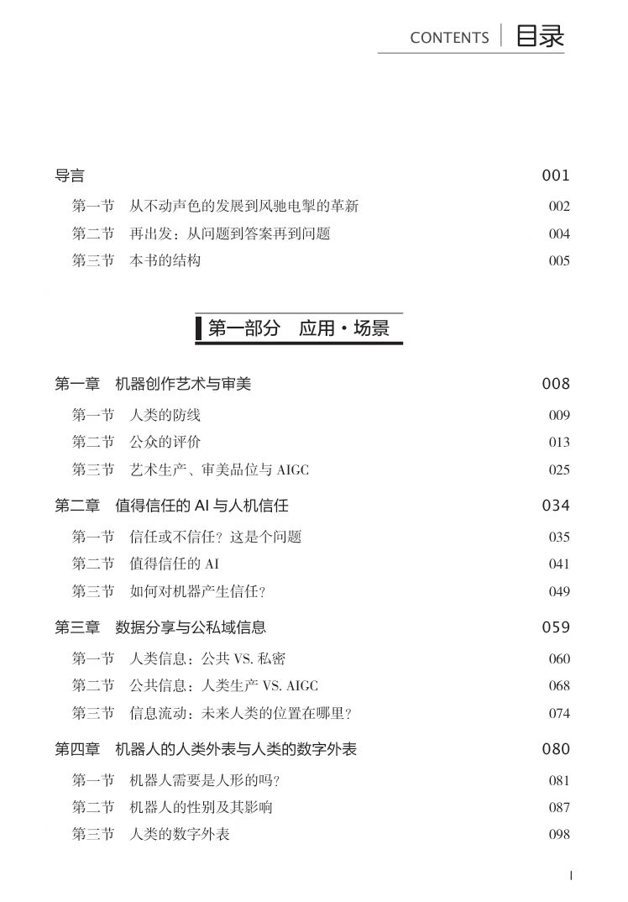
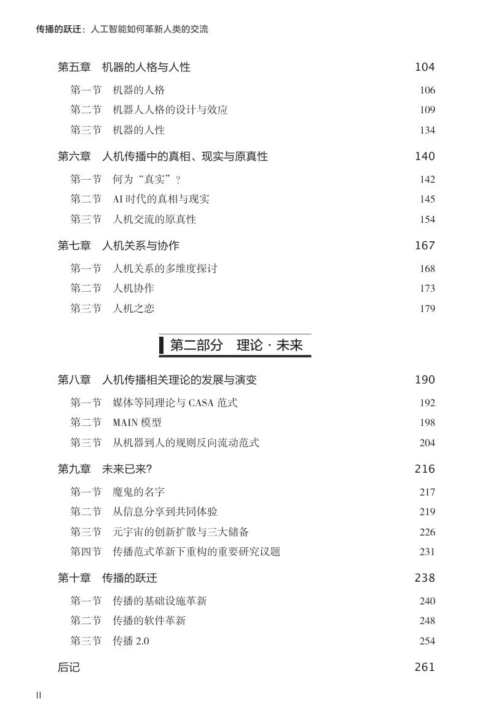

# News

### 2025.04
Welcome to our 3rd Human-Machine Communication Graduate Students Symposium on April 28, 2025!

  < img src="../images/activity.jpg" alt="" style="width:40%; height:auto">

### 2025.01
Meet us in Denver in June!

Our center is going to send out a team to attend ICA 2025. See you in Denver in June! You can search for our presentations in the ICA program. Look forward to communicating with you in person.

- Chen, J., Dai, F., & Mou, Y. (2025, June). AI Fact-checking or Rumor-debunking? Assessing the Impact of Source, Genre Type, and Heuristic Thinking on Correction Credibility. Paper to be presented at the annual convention of ICA, Denver, U.S.
- Fu, B., & Li, X. (2025, June). We Are Equally Vulnerable? An Examination of The Third-Person Effect in AI-Generated Misinformation. Paper to be presented at the annual convention of ICA, Denver, U.S.
- Guo, L., & Li, X. (2025, June). The Hidden Burden: Predicting Emotional Labor and Post-traumatic Stress Disorder (PTSD) among China’s Frontline Reporters. Paper to be presented at the annual convention of ICA, Denver, U.S.
- Huang, Y., Lan, J. (2025, June). Love the way you are: Examine the attribute of human-AI intimate relationships. Paper to be presented at the annual convention of ICA, Denver, U.S.
- Li, X., Chan, M., & Fu, B. (2025, June). Being Reciprocal for Well-being: A Dual Process from Reciprocity Norms to Psychological Well-being through Mobile Phone Checking Behaviors. Paper to be presented at the annual convention of ICA, Denver, U.S.
- Lv, Y., Chen, M., Mou, Y., & Fu, B. (2025, June). Samantha’s Legacy: Exploring Hyperpersonal Effect in Human-Machine Communication and Associated Mechanisms. Paper to be presented at the annual convention of ICA, Denver, U.S.
- Madiba, G. J., Haand, R., & Yao, Y. (2025, June). The Impact of Using ChatGPT on University Students’ Academic Performance and Critical Thinking: a moderated mediation analysis. Paper to be presented at the annual conference of ICA, Denver, US.
- Mou, Y., Chen, J., & Dai, F. (2025, June). Racing between Machine Heuristics and Authority Heuristics: The Effect of AI Sources on Correcting Scientific Misinformation in Fact-checking and Rumor-debunking. Paper to be presented at the annual convention of ICA, Denver, U.S.
- Yeilaghi, N., & Ghanbarian, A. (2025, June). Image Manipulation and Political Reality: An Experimental Study of Evidence Acceptance on social media. Paper to be presented at the annual convention of ICA, Denver, U.S.
- Zhang, L., Huang, K., & Wu, F. (2025, June). Empowerment or Strain: How Social Media Shapes Parenting Ideologies and Mental Health Among New Mothers in China. Paper to be presented at the annual convention of ICA, Denver, U.S.

### 2024.09
Congratulations on Dr. Yi Mou’s new book

Dr. Yi Mou’s new book entitled The Gravity of Communication: How Artificial Intelligence is Revolutionizing Our Ideas of Interaction（传播的跃迁：人工智能如何革新人类的交流）has been published by Tsinghua University Press recently. 

As the second book of her Human-Machine Communication Trilogy, this book integrates artificial intelligence (AI) technology, empirical research in social sciences, and humanistic speculation from an innovative interdisciplinary perspective, answering existing questions while constantly raising new ones, and continuously advancing the topic of how AI can revolutionize human communication. 

In the history of human evolution, humans and technology have always been in the game theory. Although sometimes, technology seems to escape from human control and have a tendency to escape, after a period of time, whether through the correction of technological logic or business logic, or direct legal and regulatory constraints, humans recapture technology and bring it back on track. Metaphorically, although the acceleration of technology has given it the potential to escape from the gravity of the Earth and escape to out space, it has always failed to completely free itself from the gravity of the Earth in the past. In those seemingly careless moments, which later turned out to be crucial, human civilization increased the weight of existence and brought structured technology back to a trajectory that humans could accept.

AI is not just a technology or a tool, but also a being, an other that requires human directness. It has entered a period of rapid innovation from its previous steady development, and technology is growing brutally according to its own autonomous logic. So what kind of "gravity system" should we use to recapture it? What does this gravitational system at the existential level contain? How should we build it? These questions are the main content that this book attempts to answer.

This book is suitable for researchers and students in the field of journalism and communication, as well as for readers interested in topics such as intelligent media, AI, and technological development.

内容简介：

在人类进化史中，人类与技术一直处于一种互相牵制博弈的状态中。尽管在某些时间节点上，技术貌似脱离人类的掌控而有了逃逸的趋势，但总是在一段时间后，不管是通过技术逻辑还是商业逻辑的矫正，抑或是直接的法律法规约束，人类又将技术重新俘获使之回到正轨。技术拥有的加速度虽然给了它逃离地心引力向外逃逸的潜力，但是在过去总是没能摆脱地球的重力而彻底自由。在那些当时似乎漫不经心，后来看来却关键之极的时刻，人类文明通过加重存在性的分量，让结构化的技术重新回到人类能够接纳的轨道上来。

人工智能不仅仅是一种技术、一种工具，更是一种存在，一个需要人类直而的“他者”。它已然从不动声色的发展进入风驰电掣的革新，技术正按照它自身的自主性逻辑野蛮生长。那么我们应该通过怎样的“重力系统”把它重新俘获回来呢?这种存在性层面的重力系统又包含哪些? 我们应当如何打造它?这些问题正是本书尝试回答的主要内容。

本书以创新性的跨学科视角将人工智能技术、社会科学实证研究以及人文思辨有机结合起来，在解答既有问题的同时又不断提出新的问题，将人工智能如何革新人类交流这一话题不断深入推进。本书适用于新闻传播学的研究者与学习者，也适合对智能媒体、人工智能、技术发展等话题感兴趣的广大读者阅读。

### 2024.06
**Gains and fun at ICA 2024**

Six presentations have been made at the ICA main conference, two presentations have been made at the ICA pre-conferences, and two panels have been chaired by us. It has been a fruitful trip for our team. 

Meanwhile, it has been quite an honor to witness two major achievements recognized by the global academic community. First, Dr. Carolyn A. Lin has been inducted as Fellows of the ICA (see the official news here: https://www.icahdq.org/page/2024-fellows-inductees). She has been a mentor, role model, and family to the members of our center over the years. Second, Prof. Guoliang Zhang from our school has received the Aubrey Fisher Mentorship Award (see the official news here: https://www.icahdq.org/blogpost/1523657/502151/Congratulations-ICA-2024-Award-Winners). He has been a leading figure for all of us from the school of Media and Communication, Shanghai Jiao Tong University over the past two decades. 

More importantly, we had fun in Queensland, Australia. Work hard, and play harder. Who can resist koala and wallabies anyway? 

### 2024.02
Meet us in Gold Coast, Australia!

Our center is sending out a big team to attend ICA 2024. See you in Gold Coast, Australia in June! You can search for our presentations in the ICA program. Look forward to communicating with you. 

- Guan, Y., & Mou, Y. (2024, June). Does the presence of a virtual newscaster make news watching better? Investigating the psychological mechanism behind virtual newscasting. Paper to be presented at the annual conference of ICA, Gold Coast, Australia.
- Guan, Y., Mou, Y., & Xu, J. (2024, June). Who Falls for AI Conspiracy Theory? The Roles of Perceived Profoundness of AIGC and Powerlessness in Shaping AI-related Conspiratorial Beliefs. Paper to be presented at the annual conference of ICA, Gold Coast, Australia.
- Lan, J., Huang, Y., & Mou, Y. (2024, June). Examining the Impact of Social Media Use on Chinese Male Adolescent’s Body Image: A Platform Perspective. Paper to be presented at the annual conference of ICA, Gold Coast, Australia.
- Jin Q., Lan J., Lin Z. (2024, June). Share my face: Understanding Privacy Paradox and Third-person Effect of Artificial Intelligence Generated Content (AIGC) Applications. in Proceedings of the 74th Annual International Communication Association Conference, Gold Coast, Australia, June 22, 2024.  
- Dai, F. & Chen, J. (2024, June). Fact-checking is fact-checking? A comparative analysis of four Chinese fact-checking organizations. ICA 2024, Gold Coast, Australia.
- Pan, S. (2024, June). How much AI is too much in assisting evaluation? Applicant reactions to conjoint decisions by experts and algorithm. Paper to be presented at the annual conference of ICA, Gold Coast, Australia.
