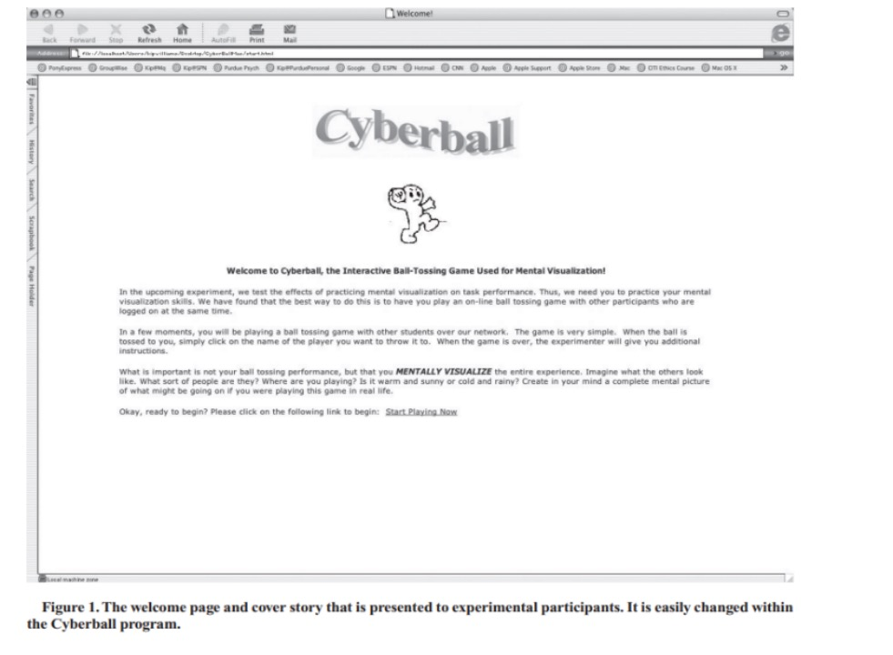
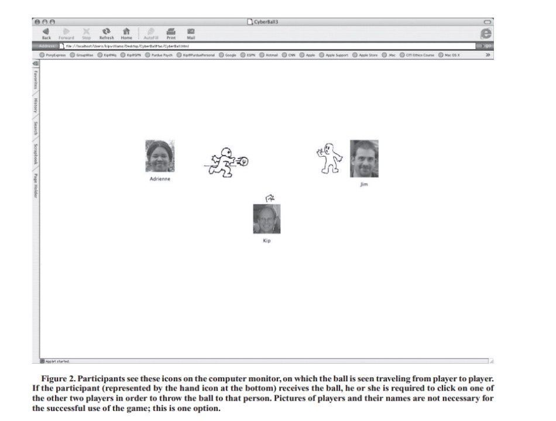
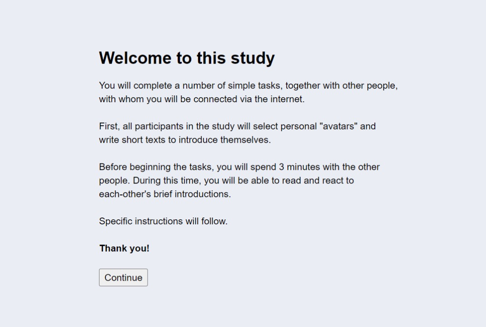
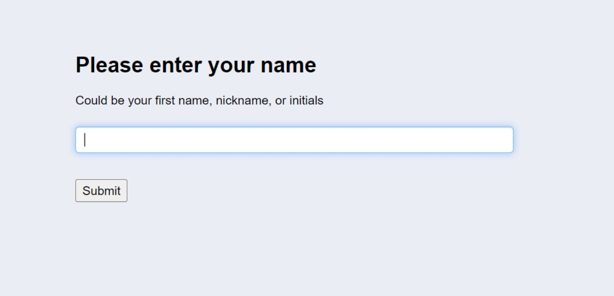
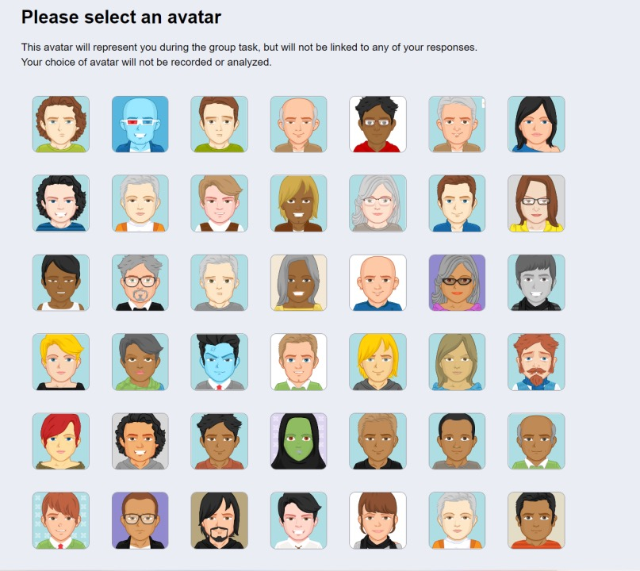
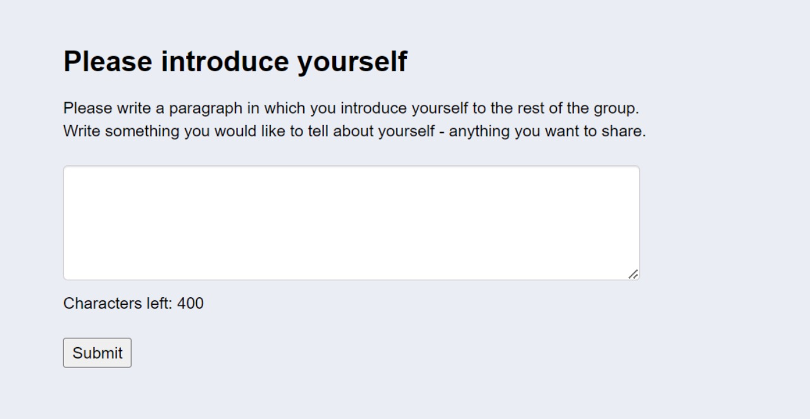
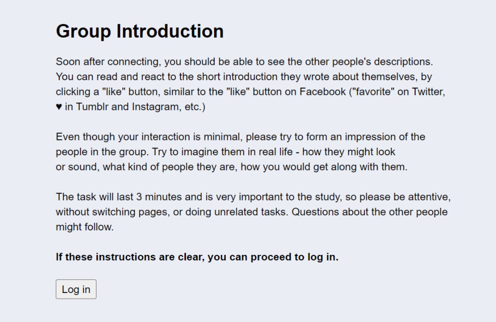
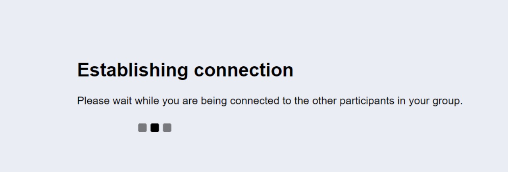
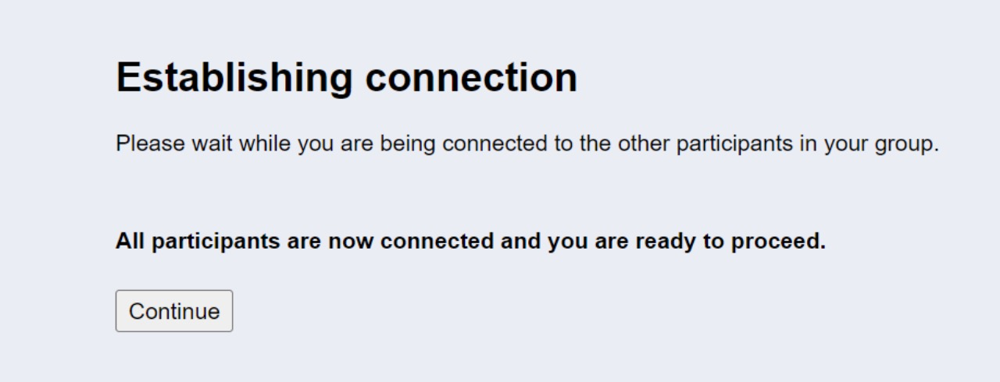
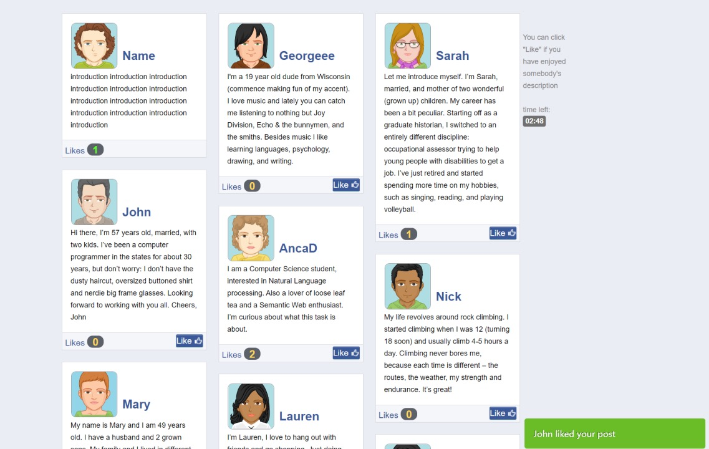

# Social Ostracism 社会排斥

## 一、Definition概念定义：

社会排斥（ostracism）指个体被忽视（ignored）或拒绝接纳(excluded)，它会诱发个体
强烈的负面心理体验（Williams, 2007）。社会排斥不仅会使被排斥的个体产生消极情感，还会损害个体的认知功能和执行功能（Juanchich et al.,2018; Reddy et al.,2019）。

社会排斥不仅影响当事人，也会使旁观者受到影响。替代性排斥(vicarious ostracism)，又称观察排斥（observed ostracism; Giesen & Echterhoff, 2018），是个体观察别人遭受排斥时产生的心理现象。体验到替代性排斥的人会产生特定情绪感受，如同情并帮助受排斥者、惩罚排斥实施者（Rudert, Ruf, & Greifeneder, 2019; Wesselmann, Wirth, Pryor, Reeder, & Williams, 2013）。

投球范式（Cyberball）和网络点赞（Likes Online）是两个常用的实验方法。以下是两个实验方法的介绍。

Giesen, A., & Echterhoff, G. (2018). Do I really feel your pain? Comparing the 
effects of observed and personal ostracism. Personality and Social Psychology Bulletin, 44(4), 550–561.
Juanchich M, Walasek L, Sirota M. Decision- makers are resilient in the face of social exclusion. British Journal of Psychology, 2018, 109(3): 604-630
Reddy LF, Irwin MR, Breen EC, et al. Social exclusion in schizophrenia: 
Psychological and cognitive consequences. Journal of Psychiatric Research, 2019, 114: 120-125
Rudert, S. C., Ruf, S., & Greifeneder, R. (2019). Whom to Punish? How observers sanction norm-violating behavior in ostracism situations. European Journal of Social Psychology, 50(2), 376–391.
Wesselmann, E. D., Williams, K. D., & Hales, A. H. (2013). Vicarious ostracism.
Frontiers in Human Neuroscience, 7(7), 153.
Williams, K. D. Ostracism: The kiss of social death. Social and Personality 
Psychology Compass, 2007（1）, 236–247.
L. Zardro, K.D. Williams, R. Richardson. How long can you go? Ostracism by a computer is sufficient to lower mood and self-reported levels of belonging, control, self-esteem, and meaningful existence. Journal of Experimental Social Psychology,2004, 40, 560-567.       

## 二、Approach 1: Cyberball 方法一：虚拟掷球

### 1.实验简介：

首先，被试被告知实验的目的是通过互动式掷球游戏锻炼心理想象能力（mental visualization）。这是掷球范式常用的托辞（cover story）。在实验过程中，被试被告知心理想象的相关内容，例如，要求被试想象另外两名玩家的状态和游戏发生的场合，且无需关注掷球表现（ball-tossing performance）本身。

屏幕上展示正在进行掷球游戏的三名玩家A（屏幕正下方）、B、C。被试以玩家A的身份参与游戏。游戏包含30次投球，游戏时长持续大约5分钟。被试被随机分派到排斥组（ostracism）或接纳组（inclusion）。在排斥组中，其中一位玩家只接到另外两个玩家的两次投球，然后再也没有玩家向这位玩家投球。在接纳组中，每位玩家接到球的次数接近。

游戏结束后，被试回答游戏相关的问题。包含操纵检验和独立测量（dependent measures）。操纵检验部分，被试需要对玩家A的接球次数做出回答，并对被排斥玩家的被忽视程度做出评估。实验有效时，被试需对游戏的组别有正确感知，即排斥组的被试需感知到目标玩家更加被忽视（ignored）且被排斥（excluded）。

常用的测量问卷是四大基本需求量表（Four Basic Needs Questionnaire, Zadro et al., 2004[]）。该量表测量四种会因排斥而降低的人类需求，包含归属感（belonging）、自尊（self-esteem）、意义维系（meaningful existence）和控制（control）。

### 2.示意图

(图片来源：K. D. Williams, B. Jarvis:《Cyberball: A program for use in research on interpersonal ostracism and acceptance》.Behavior Research Methods,2006,38(1),174-180)

### 3. References: 参考文献：

K.D. Williams, C.K.T. Cheung, W. Choi. Cyber Ostracism: Effects of being ignored over the Internet. Journal of Personality and Social Psychology, 79(2000), pp.748-762.
Wesselmann ED, Bagg D, Williams KD. “I feel your pain”: The effects of observing ostracism on the ostracism detection system. Journal of Experimental Social Psychology, 2009，45 (6): 1308-1311. http://dx.doi.org/10.1016/j.jesp.2009.08.003 

## 三、Approach 2: Likes online方法二：网络点赞
### 1.实验简介：

被试首先被告知他们将和其他参与者共同完成一项小组活动，被试与合作者将通过网络联系。实际上，只有被试一人参与，其余参与者皆是由电脑预先编号的程序。

被试被要求填写自己的姓名或化名，为自己选择一个虚拟形象，并写下一段将用于小组展示的自我介绍。在创立好自己的简介（profile）后，被试被告知他们将会在接下来3分钟内被介绍给其他小组成员。被试可以看到其他小组成员的虚拟形象和自我介绍，并可以选择为他们点赞（likes）。在3分钟内，每个小组成员收获的点赞数实时变化。在排斥情境下，被试仅收到1个点赞，在接纳情境下，被试收到6个点赞（和其余小组成员接近）。

在实验完成后，被试需回答相关问题，包含操纵检验和独立测量。操纵检验和独立测量的内容与掷球范式相同。

### 2.示意图

（图片来源：Frank M. Schneider* , Britta Zwillich y , Melanie J. Bindl a , Frederic R. Hopp b , Sabine Reich c , Peter Vorderer. 2017. Social media ostracism: The effects of being excluded online. Computers in human behavior. (73):385-393）

### 3.References参考文献：
Wolf W, Levordashka A, Ruff JR, et al. Ostracism online: A social media ostracism paradigm. Behavior Research Methods, 2015, 47(2): 361-373
Frank M. Schneider, Britta Zwillich y, Melanie J. Bindl, Frederic R. Hopp, Sabine Reich, Peter Vorderer. 2017. Social media ostracism: The effects of being excluded online. Computers in human behavior. (73):385-393